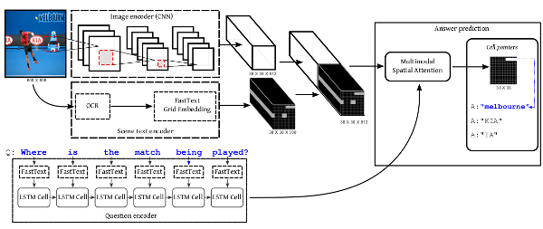

# ST-VQA_Loc

**Multimodal grid features and cell pointers for Scene Text Visual Question Answering**

Lluís Gómez, Ali Furkan Biten, Rubèn Tito, Andrés Mafla, Marçal Rusiñol, Ernest Valveny, Dimosthenis Karatzas


- ```code/``` source code and utils. See the ```code/README.md``` for details.

- ```supplementary/``` suplementary material. 

- ```STVQA_v2/``` the OCR extracted tokens per image used in this work.


This paper presents a new model for the task of scene text visual question answering, in which questions about a given image can only be answered by reading and understanding scene text that is present in it. The proposed model is based on an attention mechanism that attends to multi-modal features conditioned to the question, allowing it to reason jointly about the textual and visual modalities in the scene. The output weights of this attention module over the grid of multi-modal spatial features are interpreted as the probability that a certain spatial location of the image contains the answer text the to the given question. Our experiments demonstrate competitive performance in two standard datasets. Furthermore, this paper provides a novel analysis of the ST-VQA dataset based on a human performance study.

Diagram of the model:



Qualitative examples of the produced attention masks and predicted answers for 5 image/question pairs from the ST-VQA test set:


